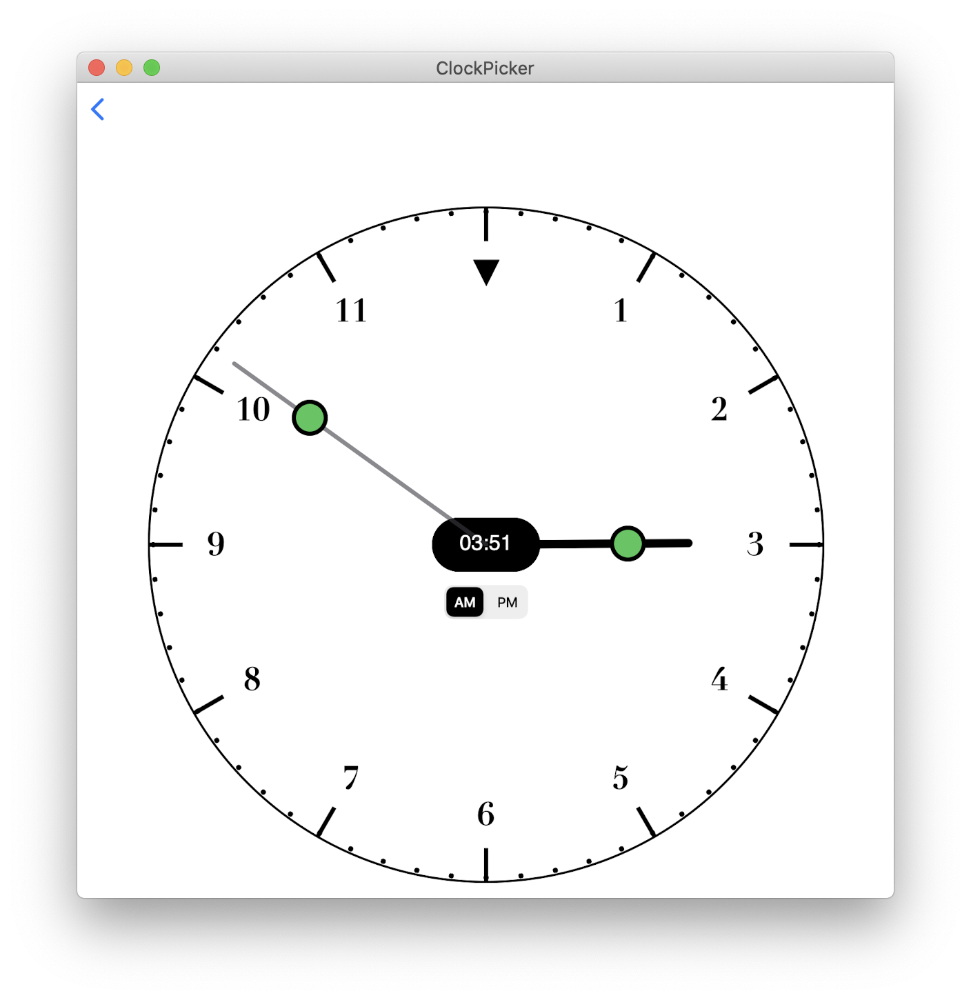
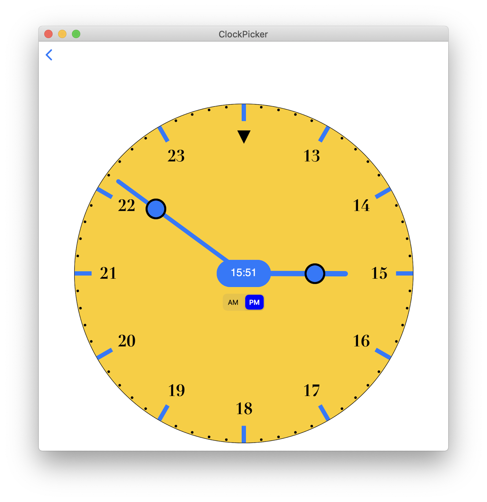
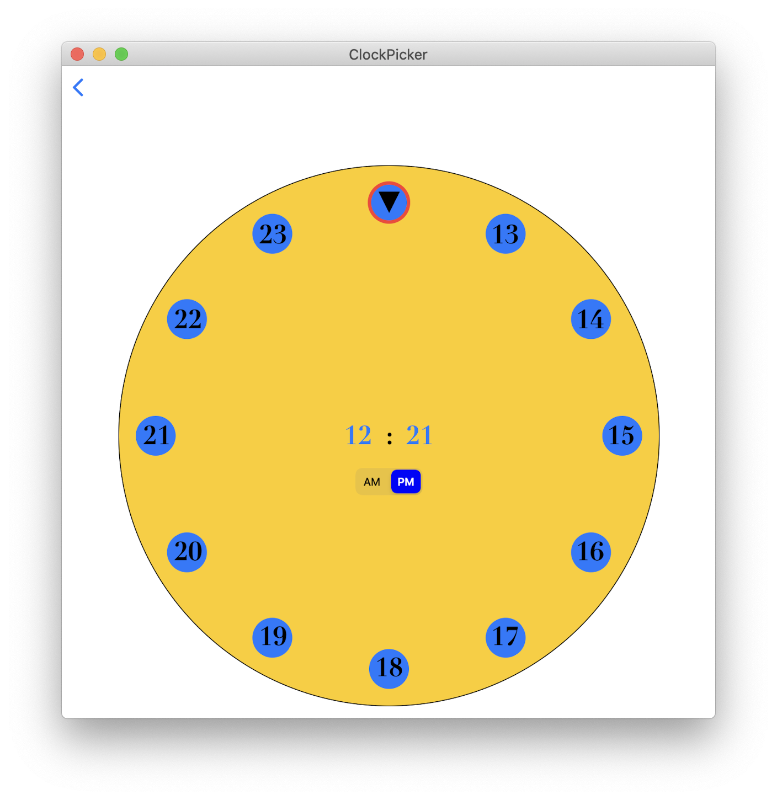
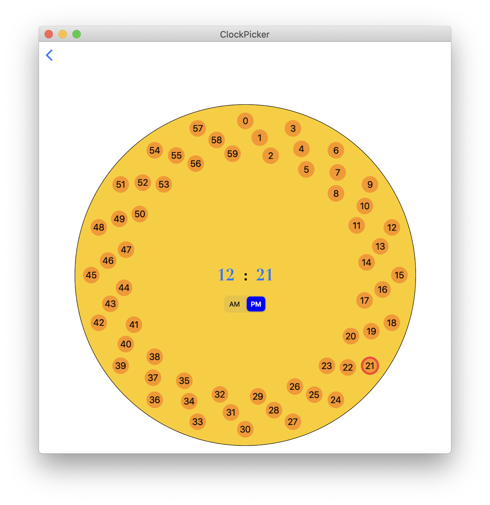

# SwiftUI Clock Time Picker

## Clock with hands

**ClockTimePicker** is a SwiftUI view that displays a clock with the hour and minutes hands.
These hands can be dragged around the clock face to select the desired hour and minutes of your date.

The main element is **ClockPickerView.swift**.

Use it like a *DatePicker*, such as:

    @State var date = Date()
    
    ClockPickerView(date: $date)

As the clock hands are changed, the *date* hour and minutes are updated.

To customise the looks of the clock, use 

    @ObservedObject var options = ClockLooks()
    
    and change the options as desired.
    
## Clock without hands

**ClockTimePicker** can also display a clock without hands, more suited to iPad and Mac. To display it set the options as:

    options.withHands = false    

To pick the hour and minutes, tap on the center **hour : minute** to display either the hours or the minutes set.

Note: adjust the sizes and colors using **options** to suit your device.

## Installation

Include the files in the "Sources/ClockTimePicker" folder into your project or use [Swift Package Manager](https://github.com/apple/swift-package-manager). See [ClockPicker](https://github.com/workingDog/ClockPicker) for an example use.

### Swift Package Manager

Create a Package.swift file and add a dependency to:

    dependencies: [
      .package(url: "https://github.com/workingDog/ClockTimePicker.git", from: "1.0.3")
    ]

Using Xcode

    Select File > Swift Packages > Add Package Dependency...,
    https://github.com/workingDog/ClockTimePicker.git

Then in your code:

    import ClockTimePicker
      
      
## Screenshots

   

     
